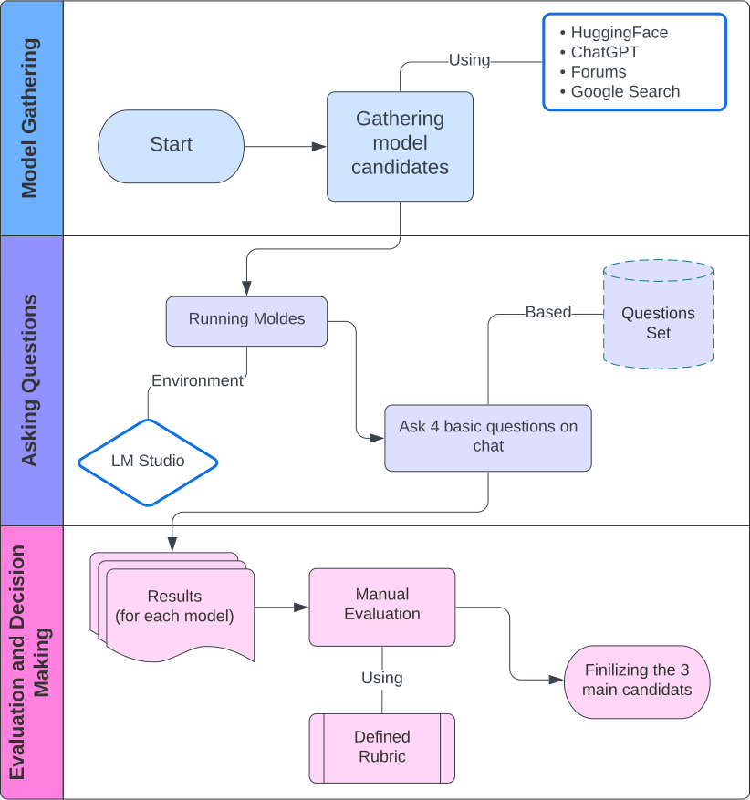
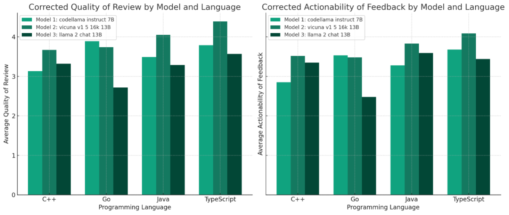

# Σ SigmaPilot

## Using Artificial Intelligence to Perform Reviews of Human Code

### 🔗 [Final Report](./Documents/Final%20Report.pdf)
 ### 🔗 [Project's Presentation](./Documents/SigmaPilot-Presentation.pdf)
 ### 🔗 [Poster](./Documents/AI%20Code%20Reviewer%20Capstone%20Poster%20one%20page.pdf)

## 📕 Table of Contents
- [Introduction](#introduction)
- [Model Evaluation and LLM Investigation](#model-evaluation-and-llm-investigation-)
  - [Model Selection Process](#model-selection-process-)
  - [Evaluation Criteria](#evaluation-criteria-)
  - [Experimental Setup](#experimental-setup-)
  - [Results and Insights](#results-and-insights-)
- [Extension Features](#extension-features)
- [Installation](#installation)
- [Usage](#usage)
- [Configuration](#configuration)
  - [Setting Up Local LLM](#setting-up-local-llm)
  - [Setting Up Remote LLM](#setting-up-remote-llm)
- [Development](#development)
- [Testing](#testing)
- [Contributing](#contributing)
- [License](#license)
- [Acknowledgements](#acknowledgements)

## Introduction

🚀 **SigmaPilot** is a state-of-the-art Visual Studio Code (VSCode) extension designed to revolutionize the code review process by leveraging the power of Artificial Intelligence (AI). Beyond its functionality as a tool within the VSCode environment, SigmaPilot embodies a robust research initiative dedicated to exploring and identifying the most effective Large Language Models (LLMs) for code review applications. This dual focus ensures that SigmaPilot not only enhances the user experience through seamless integration with both local and remote LLMs but also upholds the highest standards of user privacy, operational efficiency, and ease of use. By merging cutting-edge technology with in-depth analytical research, SigmaPilot is set to transform how developers interact with, review, and enhance their code, making it an indispensable asset in the software development lifecycle.


## 🔍 Model Evaluation and LLM Investigation 

In the SigmaPilot project, selecting the right Local Language Model (LLM) was paramount to achieving high-quality code review capabilities within the Visual Studio Code (VSCode) environment. Our evaluation process was meticulously designed to identify the most suitable model based on several critical performance metrics.

### Model Selection Process 🚀

The selection began with a comprehensive review of available LLMs, focusing on those compatible with our performance and integration requirements for a VSCode extension. The evaluation involved:

- **Initial Screening:** Over 60 models were considered, with a focus on those having less than 13 billion parameters to ensure smooth operation on typical development systems.
- **Detailed Testing:** A subset of models was then subjected to detailed testing using a variety of coding tasks and programming languages.

### Evaluation Criteria 📏

To objectively assess each model, we developed a set of evaluation criteria that included:

- **Accuracy:** The correctness and relevance of the responses provided by the model for given code snippets.
- **Clarity:** The clarity and understandability of the model’s explanations and suggestions.
- **Integration Capability:** Ease of integration with the VSCode environment and performance stability during extended use.

### Experimental Setup 🧪

The models were evaluated using a specific set of prompts designed to simulate real-world coding tasks. Here’s how we structured our experiments:

- **Figure 1: Model Evaluation Workflow**
  
  
  This diagram illustrates the step-by-step process we followed, from initial model screening to final selection.

- **Testing Environment:** Tests were conducted using LM Studio, allowing for controlled and consistent model interaction.
- **Prompts Used:** A variety of prompts covering common programming tasks and languages were employed to thoroughly test each model's capabilities.

### Results and Insights 📊

Based on our evaluations, we selected the model that exhibited the best balance between accuracy, efficiency, and integration suitability. The chosen model demonstrated:

- **High Accuracy:** Excelling at both syntax correctness and logical coherence in code suggestions.
- **Clear Explanations:** Providing concise and understandable explanations tailored for developers.
- **Seamless Integration:** Demonstrating robust performance within the VSCode extension without significant resource overhead.

**Figure 2: Model Performance Comparison**


This chart compares the top-performing models across various evaluation metrics, highlighting the superior performance of our chosen model.

By employing a rigorous evaluation framework, we ensured that SigmaPilot is equipped with a powerful and efficient LLM, ready to enhance the code review process for developers directly within their coding environment.


## Extension Features

✨ **Key Features:**
- **Seamless Integration:** Direct integration with VSCode.
- **Flexible LLM Support:** Connects to both local and remote LLMs.
- **Enhanced Code Review:** Provides AI-driven insights for code improvement.
- **Data Privacy:** Ensures user privacy with local model connections.
- **User-Friendly Interface:** Easy configuration and usage.

## Installation

🛠️ **Installation Steps:**

### Prerequisites
- Visual Studio Code installed on your machine.
- Node.js installed on your machine.

### Steps
1. Clone the repository:
   ``` sh git clone https://github.com/Software-Sigmas/SIgmaPilot.git ```
2. Navigate to the extension directory:
   ```sh cd SIgmaPilot ```
3. Install the dependencies:
   ```sh npm install ```
4. Open VSCode and start the extension:
   ```sh code . ```
5. Press `F5` to open a new VSCode window with the extension loaded.

## Usage

🖥️ **How to Use:**

1. Open the SigmaPilot sidebar in VSCode.
2. Configure your model settings (URL, API key, model name, max tokens).
3. Select the code you want to review.
4. Choose the task you want the AI to perform (formatting, efficiency, explanation).
5. View the AI's recommendations and modifications directly in the VSCode interface.

## Configuration

⚙️ **Configuration:**

### Setting Up Local LLM

1. Download and install LM Studio.
2. Configure LM Studio to host your desired LLM.
3. Use the following configuration in SigmaPilot:
   - **URL:** `http://localhost:8000`
   - **API Key:** Your LM Studio API key

### Setting Up Remote LLM

1. Obtain an API key from your remote LLM provider (e.g., OpenAI).
2. Use the following configuration in SigmaPilot:
   - **URL:** Provider's URL
   - **API Key:** Your API key
   - **Model Name:** The name of the model you wish to use
   - **Max Tokens:** Set the maximum token limit for responses

## Development

💻 **Development Guide:**

### Project Structure
- `src/`: Contains the source code for the extension.
- `src/extension.ts`: The main entry point for the extension.
- `src/sidebar/`: Contains the Svelte components for the sidebar UI.
- `package.json`: Project configuration and dependencies.

### Building the Extension
To build the extension from source:
```sh npm run build ```

### Running Tests
To run tests:
```sh npm test ```

## Testing

🧪 **Testing:**

1. **Local Testing:**
   - Set up a local instance of LM Studio.
   - Validate API calls using Postman.
   - Ensure the extension correctly communicates with the local model.

2. **Remote Testing:**
   - Deploy the model on a cloud service (e.g., Google Colab, AWS).
   - Use Postman to validate API connections.
   - Test the extension's integration with remote models.

## Contributing

🤝 **Contributing:**

We welcome contributions to SigmaPilot! Please follow these steps to contribute:

1. Fork the repository.
2. Create a new branch (`git checkout -b feature/YourFeature`).
3. Commit your changes (`git commit -m 'Add some feature'`).
4. Push to the branch (`git push origin feature/YourFeature`).
5. Create a new Pull Request.

## License

📜 **License:**

This project is licensed under the MIT License. See the [LICENSE](LICENSE) file for details.

## Acknowledgements

🙏 **Acknowledgements:**

- **Project Manager:** Mikhail Nathoo
- **Team Members:** Ernest Nikolaychuk, Mikhail Nathoo, Tanish Datta, Sam Farzamfar, Saman Pordanesh
- **Teacher Assistant:** Manuel Zamudio Lopez
- **Academic Advisor:** Dr. Gouri Ginde Deshpande
- **Sponsor Representative:** Mr. Alex Shaharudin
- **Sponsor Company:** Network Innovations Inc

Special thanks to all our stakeholders and contributors for their support and guidance throughout this project.
